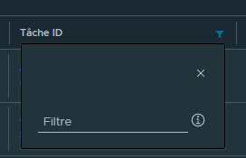
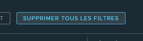

# Filtering

**Filtering** is the process of reducing the number of items in a collection based on a set of criteria. ArmoniK Admin GUI allows you to filter every build-in columns of the datagrids.

## How to filter?

To filter a column, you have to click on the icon on the left side of an header. A filter will appear. Depending on the type of the column, you will have different filters.

- For a **string** column, you will have a text input.
- For a **number** column, you will have a number input.
- For a **boolean** column, you will have a checkbox.
- For a **date** column, you will have a date picker.
- For a **list** column, you will have a select.

## How to filter on multiple columns?

To filter on multiple columns, you have to repeat the previous step for every columns you want to filter.

## How to remove the filter?

To remove every filters, you have to click on the **Clear Filters** button. But you can also remove a filter by clicking on the **Clear** in the filter box.

## How to filter on custom columns?

Currently, you can't filter on custom columns.

::: info
To learn more about custom columns, please read the [Custom Columns](./datagrid-custom-columns.md) page.
:::

