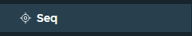
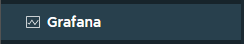

# External services

Directly from the GUI, you can access to external services, deployed in the cluster, such as:

- [SEQ](https://datalust.co/seq)
- [Grafana](https://grafana.com/)

::: info
To deploy them, please refer to the [ArmoniK documentation](https://aneoconsulting.github.io/Armonik/)
:::

## SEQ

SEQ is a log aggregator. It allows you to centralize all the logs of ArmoniK. You can access it by clicking on the SEQ button in the left navigation bar.

::: warning
In case the SEQ button is not visible, please check that the SEQ service is deployed in your cluster.
:::

## Grafana

Grafana is a dashboard tool. It allows you to visualize the metrics of ArmoniK like the number of tasks. You can access it by clicking on the Grafana button in the left navigation bar.

::: warning
In case the Grafana button is not visible, please check that the Grafana service is deployed in your cluster.
:::
