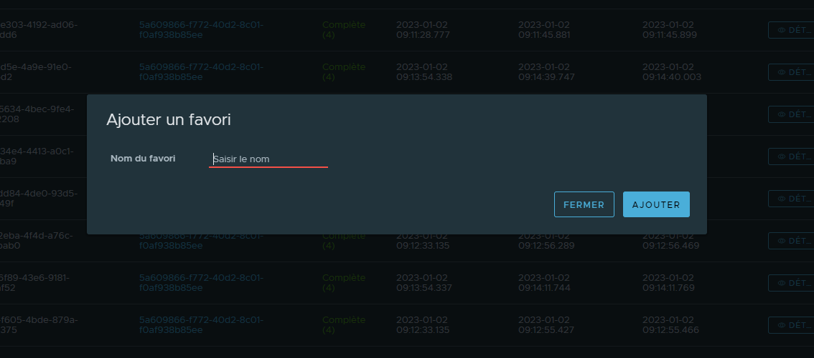
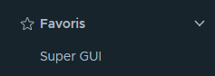

# Favorites

A favorite is a shortcut to a specific URL. You can add multiple favorites per page if the URL is different.

They are useful to quickly access a specific page with a predefined set of filters and sorting.

## Add a favorite

To add a favorite, you've just to click on the star icon in the top right corner of the page.

::: tip
The start is empty when the page is not a favorite.
:::

Then, a modal will open to ask you to enter a name for the favorite. The name is used to identify the favorite in the list.

Once you've entered a name, you can click on the "Add" button to add the favorite to the list.

::: warning
You can't have the same favorite twice or favorites with the same name.
:::

## List of favorites

You can access to your favorites using the navigation bar. You can open the menu named "Favorites" and you'll see the list of your favorites.

## Remove a favorite

To remove a favorites, you've just to click on the star icon in the top right corner of the page.

::: tip
The start is filled when the page is a favorite.
:::

The favorite will be removed from the list.
